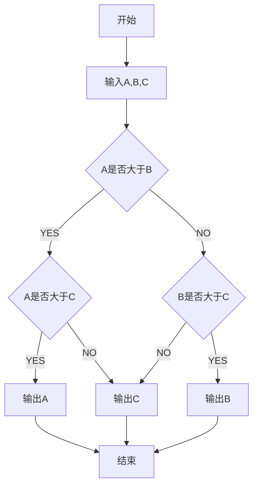

# 机载空空导弹任务分配技术研究

## 摘要

 现代战争中，制空权具有重要的战略意义，空空导弹则是争夺制空权的重要武器。制导技术的发展使得空空导弹的性能有了大幅度的提升，而反导技术的进步也对空空导弹提出了新的挑战。空战环境下往往存在多个目标，并且目标具有较强的机动能力，单枚导弹攻击单个目标的作战模式将难以适应这种场景，而空空导弹集群作战，面向多个目标，以提升整体作战性能为目标，是空空导弹的重要发展方向。

本文首先针对空空导弹的特点与历史发展进行了系统的介绍和分析，为后序空空导弹任务分配模型的建立提供理论依据和事实依据。本文系统介绍了导弹制导系统的组成和工作原理，导弹命中率的影响因素，空空导弹在实战中面临的主要问题，目标规避导弹的运动模式等。

接着，本文从空空导弹任务分配的角度出发，充分考虑集群作战的各个阶段的特点，考虑载机与目标，导弹与目标两种空战关系，并考虑空战环境下的作战约束条件，分别建立了混合整数规划模型和广义指派模型。

然后，本文针对不同阶段模型的特点选取了针对性的算法进行求解分析。载机与目标的态势较量是空战的第一阶段，在这一阶段，本文根据空战态势建立了混合整数规划模型，以载机获得最大优势为主要目标，对载机的运动方向进行动态任务分配，使得各个载机尽快到达可攻击区域。在这一阶段，本文采用了任务分配问题领域常用的启发式算法进行仿真分析，包括：遗传算法、粒子群算法、模拟退火算法、蚁群优化算法。并结合量子优化算法对以上算法进行了改进，尤其在针对启发式算法种群多样性不足，收敛速度慢、后期容易陷入局部最优的问题进行了深入分析。在载机发射导弹后，考虑导弹和目标之间的关系，建立了广义指派模型。针对广义指派模型，本文采用匈牙利算法，拍卖算法，分支定界法分别进行求解，并提出了一种基于贪心策略和随机策略的分配算法——概率选择分配算法，本文重点这部分重点对该算法进行了理论分析和数学证明，并对其进行了仿真验证。

最后，针对毁伤评估问题，本文建立了Dubins旅行商模型，以启发式算法进行求解，最后由自组织神经网络得到启发，提出了针对旅行商问题的自组织有序链算法，仿真实验表明，该算法针对旅行商问题具有较好的适用性。

**关键词**： 空空导弹 任务分配 启发式算法 

## 第一章 绪论

### 1.1 课题研究背景及意义

### 1.2 国内外研究现状及发展趋势

## 第二章 机载空空导弹任务模型

### 载机空战态势模型  

多目标指派，市场，

### 导弹空战态势模型

指派，市场

### 非平衡分配模型及其转化

### 毁伤评估模型

## 第三章 动态环境下载机任务预分配

### 规则算子

## 

### 基于规则启发式算法的任务分配

#### 模拟退火算法

### 基于混合启发式算法的任务分配

### 仿真分析

| 7    | 1    | 1    | 4    | 2    | 5    | 2    | 6    | 3    | 3    |
| -------- | ---- | ---- | ---- | ---- | ---- | ---- | ---- | ---- | ---- |
| 7| 1| 1| 4| 2| 5| 2| 6| 3| 3|
| 7| 1| 1| 4| 2| 5| 2| 6| 3| 3|
| 7| 1| 1| 4| 2| 5| 2| 6| 3| 3|
| 7| 1| 1| 4| 2| 5| 2| 6| 3| 3|
| 7| 1| 1| 4| 2| 5| 2| 6| 3| 3|
| 7| 1| 1| 4| 2| 5| 2| 6| 3| 3|
| 7| 1| 1| 4| 2| 5| 2| 6| 3| 3|
| 7| 1| 1| 4| 5| 2| 2| 6| 3| 3|
| 7| 1| 1| 4| 5| 2| 2| 6| 3| 3|
| 7| 1| 1| 4| 5| 2| 2| 6| 3| 3|
| 1| 3| 1| 4| 2| 5| 2| 6| 7| 3|
| 1| 3| 1| 4| 2| 5| 2| 6| 7| 3|
| 1| 3| 1| 4| 2| 5| 6| 2| 7| 3|
| 1| 1| 3| 4| 2| 5| 6| 2| 7| 3|
| 1| 1| 3| 4| 2| 5| 6| 2| 7| 3|
| 1| 1| 3| 4| 2| 5| 6| 2| 7| 3|
| 1| 1| 3| 4| 2| 6| 5| 2| 7| 3|
| 1| 1| 3| 4| 2| 6| 5| 2| 7| 3|
| 1| 1| 3| 4| 2| 5| 6| 2| 7| 3|
| 1| 1| 3| 4| 2| 6| 5| 2| 7| 3|
| 1| 1| 3| 4| 2| 6| 5| 2| 3| 7|
| 2| 1| 3| 4| 2| 6| 5| 1| 7| 3|
| 2| 1| 3| 4| 2| 6| 5| 1| 7| 3|
| 2| 1| 3| 4| 2| 5| 6| 1| 7| 3|
| 2| 1| 3| 4| 2| 6| 5| 1| 7| 3|
| 2| 1| 3| 4| 2| 6| 5| 1| 7| 3|
| 2| 5| 3| 4| 2| 6| 1| 1| 7| 3|
| 2| 5| 3| 4| 2| 6| 1| 1| 7| 3|
| 2| 5| 3| 4| 1| 2| 6| 1| 7| 3|
| 2| 5| 3| 4| 1| 2| 6| 1| 7| 3|
| 7| 2| 3| 4| 1| 5| 6| 1| 3| 2|
| 7| 2| 3| 4| 2| 5| 6| 1| 3| 1|
| 7| 2| 3| 4| 2| 5| 6| 1| 3| 1|
| 7| 5| 3| 4| 2| 2| 6| 1| 3| 1|
| 7| 1| 5| 4| 2| 2| 6| 1| 3| 3|
| 7| 1| 5| 4| 2| 2| 6| 1| 3| 3|
| 7| 2| 5| 4| 1| 2| 6| 1| 3| 3|
| 7| 2| 5| 4| 1| 2| 6| 1| 3| 3|
| 7| 2| 5| 4| 1| 2| 6| 1| 3| 3|
| 7| 2| 5| 4| 1| 2| 6| 1| 3| 3|
| 7| 2| 5| 4| 1| 2| 6| 1| 3| 3|
| 7| 2| 5| 4| 1| 2| 6| 1| 3| 3|
| 7| 2| 1| 4| 5| 2| 6| 1| 3| 3|
| 7| 2| 2| 4| 1| 5| 6| 1| 3| 3|
| 7| 2| 2| 4| 1| 5| 6| 1| 3| 3|
| 7| 2| 5| 4| 1| 2| 6| 1| 3| 3|
| 7| 2| 5| 4| 1| 2| 6| 1| 3| 3|
| 1| 2| 5| 4| 1| 2| 6| 7| 3| 3|
| 1| 2| 5| 4| 1| 2| 6| 7| 3| 3|
| 1| 2| 5| 4| 1| 2| 6| 7| 3| 3|
| 1| 2| 5| 4| 1| 2| 6| 7| 3| 3|
| 1| 1| 2| 4| 2| 5| 6| 7| 3| 3|
| 1| 1| 2| 4| 2| 5| 6| 7| 3| 3|
| 1| 1| 2| 4| 2| 5| 6| 7| 3| 3|
| 1| 1| 2| 4| 2| 5| 6| 7| 3| 3|
| 1| 1| 5| 4| 2| 2| 6| 7| 3| 3|
| 1| 1| 5| 4| 2| 2| 6| 7| 3| 3|
| 1| 1| 5| 4| 2| 2| 6| 7| 3| 3|
| 1| 5| 1| 4| 2| 2| 6| 7| 3| 3|
| 1| 5| 1| 4| 2| 2| 6| 7| 3| 3|
| 1| 2| 1| 4| 5| 2| 6| 7| 3| 3|
| 1| 2| 1| 4| 5| 2| 6| 7| 3| 3|
| 1| 2| 1| 4| 2| 5| 6| 7| 3| 3|
| 1| 5| 1| 4| 2| 2| 6| 7| 3| 3|
| 1| 2| 1| 4| 2| 5| 6| 7| 3| 3|
| 1| 2| 2| 4| 1| 5| 6| 7| 3| 3|
| 1| 2| 1| 4| 2| 5| 6| 7| 3| 3|
| 1| 2| 1| 4| 2| 5| 6| 7| 3| 3|
| 1| 5| 1| 4| 2| 2| 6| 7| 3| 3|
| 1| 5| 1| 4| 2| 2| 6| 7| 3| 3|
| 1| 5| 2| 4| 3| 2| 6| 7| 1| 3|
| 1| 5| 2| 4| 1| 2| 6| 7| 3| 3|
| 1| 5| 2| 4| 1| 2| 6| 7| 3| 3|
| 1| 2| 2| 4| 1| 5| 6| 7| 3| 3|
| 1| 5| 1| 4| 2| 2| 6| 7| 3| 3|
| 1| 2| 5| 4| 1| 2| 6| 7| 3| 3|
| 1| 2| 2| 4| 1| 5| 6| 7| 3| 3|
| 1| 2| 1| 4| 2| 5| 6| 7| 3| 3|
| 1| 5| 1| 4| 2| 2| 6| 7| 3| 3|
| 1| 5| 1| 4| 2| 2| 6| 7| 3| 3|
| 1| 2| 1| 4| 2| 5| 6| 7| 3| 3|
| 1| 2| 1| 4| 2| 5| 6| 7| 3| 3|
| 1| 2| 1| 4| 2| 5| 6| 7| 3| 3|
| 1| 2| 1| 4| 2| 5| 6| 7| 3| 3|
| 1| 3| 5| 4| 2| 2| 6| 7| 1| 3|
| 1| 3| 5| 4| 2| 2| 6| 7| 1| 3|
| 1| 3| 5| 4| 2| 2| 6| 7| 1| 3|
| 1| 3| 2| 4| 2| 5| 6| 7| 1| 3|
| 1| 2| 5| 4| 3| 2| 6| 7| 3| 1|
| 1| 2| 2| 4| 3| 5| 6| 7| 3| 1|
| 1| 2| 5| 4| 1| 2| 6| 7| 3| 3|
| 1| 2| 5| 4| 1| 2| 6| 7| 3| 3|
| 1| 2| 5| 4| 1| 2| 6| 7| 3| 3|
| 1| 2| 5| 4| 1| 2| 6| 7| 3| 3|
| 1| 2| 2| 4| 1| 5| 6| 7| 3| 3|
| 1| 5| 2| 4| 1| 2| 6| 7| 3| 3|
| 1| 5| 2| 4| 1| 2| 6| 7| 3| 3|
| 1| 5| 2| 4| 1| 2| 6| 7| 3| 3|
| 1| 5| 2| 4| 1| 2| 6| 7| 3| 3|
| 1| 1| 2| 4| 2| 5| 6| 7| 3| 3|
| 1| 1| 2| 4| 2| 5| 6| 7| 3| 3|
| 1| 1| 2| 4| 2| 5| 6| 7| 3| 3|
| 1| 1| 2| 4| 2| 5| 6| 7| 3| 3|
| 1| 1| 2| 4| 2| 5| 6| 7| 3| 3|
| 1| 1| 2| 4| 2| 5| 6| 7| 3| 3|
| 1| 1| 2| 4| 2| 5| 6| 7| 3| 3|
| 1| 1| 2| 4| 3| 2| 6| 7| 5| 3|
| 1| 1| 2| 4| 3| 2| 6| 7| 5| 3|
| 3| 1| 1| 4| 2| 2| 6| 7| 5| 3|
| 3| 1| 1| 4| 2| 2| 6| 7| 5| 3|
| 1| 3| 1| 4| 2| 2| 6| 7| 5| 3|
| 1| 3| 1| 4| 2| 2| 6| 7| 5| 3|
| 2| 3| 5| 4| 1| 2| 6| 7| 1| 3|

## 第四章 动态环境下空空导弹实时任务分配与制导

### 基于拍卖算法的任务分配

### 基于分支定界法的任务分配

### 基于匈牙利算法的任务分配

### 基于贪心策略的最大概率收敛算法

### 基于比例导引的制导律设计

### 仿真算例与分析

## 第五章 载机毁伤评估任务分配

### 基于启发式算法的任务分配

### 基于自适应有序链的任务时序分配

本文基于自适应神经网络模型，针对tsp问题提出了自适应有序链算法。

### 仿真算例与分析

| 算法 | 平均最优值 | 最差值 | 最好值 | 平均收敛步数 | 执行时间 |
| ---- | ---- | ---- | ---- | ---- | ---- |
| TSPSOM | 33681.7 |35737.7 | 32139.8 | 9000 | 15.49 |
| MTSPSOM | 32057.8 |32336.4 | 31673.7 | 9000 | 15.91 |
| STSPSOM | 34168.5 |35911.9 | 32320.6 | 9000 | 15.47 |
| CTSPSOM | 33895.8 |35157.8 | 32649.8 | 9000 | 15.26 |
| DTSPSOM | 31795.3 |32205.7 | 31284.9 | 9000 | 16.04 |
| ISTSPSOM | 31527.3 |31853.2 | 31100.1 | 9000 | 15.80 |
| ICTSPSOM | 31628.2 |32893.7 | 30946.1 | 9000 | 16.91 |
| IDTSPSOM | 31630.1 |32092.4 | 30890.5 | 9000 | 16.19 |
| ILS | 30466.5 |30466.5 | 30466.5 | 956 | 260.0 |
| SA | 31285.8 |32009.1 | 30878.1 | 97 | 9.90     |
| SAGA | 30835.1 | 30965.2 | 30660.5 | 129 | 49.61    |
| ACO | 33934.4 | 33534.2 | 33091.0 | 64 | 66.81    |

|  数据集  | 规模  |   算法   | 平均误差 | 平均执行时间/s | 已知最优值 |
| :------: | :---: | :------: | :------: | :------------: | :--------: |
|  att48   |  48   |    SA    |  0.080%  |      7.2       |   33522    |
|  att48   |  48   |   ILS    |  0.005%  |      7.0       |   33522    |
|  att48   |  48   | IDTSPSOM |  0.968%  |      14.7      |   33522    |
|  chn144  |  144  |    SA    |  4.140%  |      10.8      |   30347    |
|  chn144  |  144  |   ILS    |  0.393%  |     165.3      |   30347    |
|  chn144  |  144  | IDTSPSOM |  4.228%  |      16.5      |   30347    |
|   a280   |  280  |    SA    | 11.318%  |      15.2      |    2579    |
|   a280   |  280  |   ILS    |  1.675%  |     1977.0     |    2579    |
|   a280   |  280  | IDTSPSOM | 10.434%  |      18.7      |    2579    |
|  ali535  |  535  |    SA    |  9.265%  |      24.3      |   202339   |
|  ali535  |  535  |   ILS    |  1.240%  |     12395      |   202339   |
|  ali535  |  535  | IDTSPSOM | 11.444%  |      19.1      |   202339   |
|  rl1304  | 1304  |    SA    | 25.860%  |     123.8      |   252948   |
|  rl1304  | 1304  |   ILS    |          |                |   252948   |
|  rl1304  | 1304  | IDTSPSOM | 17.767%  |      43.4      |   252948   |
| usa13509 | 13509 |    SA    |    -     |       -        |  19982859  |
| usa13509 | 13509 |   ILS    |    -     |       -        |  19982859  |
| usa13509 | 13509 | IDTSPSOM | 50.544%  |    48283.4     |  19982859  |

## 总结

  
## 参考文献
[1]  [参考文献1](./参考文献/1Research on Task Assignment Optimization.pdf)

