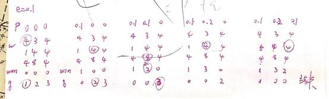
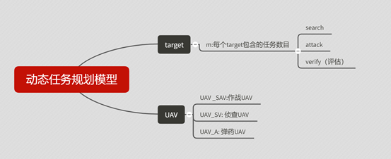

### 1. Research on Task Assignment Optimization Algorithm Based on Multi-Agent

Jie Zhang1,Gang Wang2,Xiaoqiang Yao2, Yafei Song1, Fangzheng Zhao1

 

来源：https://ieeexplore.ieee.org/document/8623121

模型：多智能体任务分配，多目标，收益，损失，

目标函数：收益-损失

算法：拍卖算法

### 2. 拍卖算法研究及其应用

这篇对算法理论进行了细致证明，可以参考。

拍卖算法参考https://blog.csdn.net/vict_wang/article/details/86584435

博客里用的更新公式不太好，因为无法保证误差。

拍卖算法过程：

给定价格矩阵w, 求最大化指派。列代表物品，行代表竞拍者。矩阵值代表竞拍者认为该物品可以值的价格，可以这样理解，竞拍者可以以这个价格再卖给别人。所以每个人都想得到物品，买下来的价格p越小越好。

更新过程如下：

p 物品的价格向量，初始全为0，竞拍不断加价。

won 竞拍者，won=[0,1,0]代表1号竞拍者得到2号物品。0代表没有人。

q 剩余竞拍者队列，还没有得到物品的人。最好的实现方式是队列，程序中用数组。

每次从q选取一个没有得到物品的人，算每个物品对该人可以有多大利润，选取最大的。直到所有人都分到物品。调试过后的代码放在 MATLAB\算法分类\拍卖算法\AuctionJacobi

竞拍者i 的满意度指i行有利润大于0的物品就可以，或者在该行，选中的物品价值加上e是最大的。满意度值是0或者1。

这个算法在e取太大时会出错。

### 3、Study on Multi-UAV Task clustering and Task Planning in Cooperative Reconnaissance

Zhao Junwei

https://ieeexplore.ieee.org/document/6911527

 

无人机任务分配：先进行任务聚类，再对每一类进行航迹规划，这里用的是TSP问题。

聚类用k-means ,聚类目标是使得每类目标的执行时间趋于平均。

### 5、分布式协同动态任务规划的建模与一体化求解方法

http://www.wanfangdata.com.cn/details/detail.do?_type=perio&id=zggxjsxb201704018

 

动态任务规划

模型：

用**Dubins**路线当作路线长度。

算法没有讲清楚。模型可以参考一下。

### 6．多异构无人机任务规划 的分布式一体化求解方法

http://xueshu.baidu.com/usercenter/paper/show?paperid=190c08q0t9370440uh4x04d0et063627&site=xueshu_se

模型和上一篇差不多，算法讲清楚了。

### 7、动态环境中的无人机路径规划方法

http://www.wanfangdata.com.cn/details/detail.do?_type=perio&id=bjhkhtdxxb201402020

对于二维环境的动态障碍物用概率地图的方式来表示，模型可以参考。

### 8、基于作战模式驱动的巡航导弹协同作战任务规划研究

张明星

[链接](http://kns.cnki.net/KCMS/detail/detail.aspx?dbcode=CJFQ&dbname=CJFDLAST2018&filename=ZHKZ201801011&uid=WEEvREdxOWJmbC9oM1NjYkZCbDdrdXQyZVk2WlJaWndNdGhnWSt3cXhmTWI=$R1yZ0H6jyaa0en3RxVUd8df-oHi7XMMDo7mtKT6mSmEvTuk11l2gFA!!&v=MzI0NDBGckNVUkxPZlllZG5GeS9sVzd2T1B5WEFkTEc0SDluTXJvOUVaWVI4ZVgxTHV4WVM3RGgxVDNxVHJXTTE=)

对巡航导弹的协同模式比较清楚。

### 9.美国面向未来战争的导弹协同作战概念发展研究_赵鸿燕.

[链接](https://kns.cnki.net/KCMS/detail/detail.aspx?dbcode=CJFQ&dbname=CJFDTEMP&filename=HKBQ201904001&uid=WEEvREcwSlJHSldRa1FhcTdWa2FjR2F3UUxRd2RCUzlaVVFPMlJ0VmFHVT0=$9A4hF_YAuvQ5obgVAqNKPCYcEjKensW4IQMovwHtwkF4VYPoHbKxJw!!&v=MjgyNDBGckNVUkxPZVorZHZGeTNoVTd2TUxTYkpmN0c0SDlqTXE0OUZaWVI4ZVgxTHV4WVM3RGgxVDNxVHJXTTE=)

基本概念可以参考。导弹的任务规划概念，以及和其它相关研究的概念

### 10.基于改进PSO的多UAV协同任务分配研究

[link](https://kns.cnki.net/KCMS/detail/50.1213.TJ.20190920.1707.006.html?uid=WEEvREcwSlJHSldRa1FhdXNXaEhobmc4cTkrNjNTUzY2bGhCb3RsR0VQST0=$9A4hF_YAuvQ5obgVAqNKPCYcEjKensW4IQMovwHtwkF4VYPoHbKxJw!!&v=MDYwNDhUM2ZscVdNMENMTDdSN3FlYnVkdkZ5amxWYjdMSTFvPUpqalRaN0c0SDlqTXBvMUZaT3NPWXc5TXptUm42ajU3)

模型可以参考

### 11空战多目标分配的指派模型

[link](https://kns.cnki.net/KCMS/detail/detail.aspx?dbcode=CJFQ&dbname=CJFD2008&filename=HJHK200801018&uid=WEEvREcwSlJHSldRa1Fhb09jT0lPd1RPclBETnBDQXhtZFBLUnZRNW50dz0=$9A4hF_YAuvQ5obgVAqNKPCYcEjKensW4IQMovwHtwkF4VYPoHbKxJw!!&v=MTcwODZPZVorUnNGeS9uVTczTUxTZkRaYkc0SHRuTXJvOUViSVI4ZVgxTHV4WVM3RGgxVDNxVHJXTTFGckNVUkw=)

态势模型，目前采用

### 12反舰导弹协同任务规划系统研究

李红亮  [link]( https://kns.cnki.net/KCMS/detail/detail.aspx?dbcode=CJFQ&dbname=CJFD2012&filename=FHDD201209009&uid=WEEvREdxOWJmbC9oM1NjYkcyQzZ4Q2Z0ZEhsTGppL3dSL2ZyakRPOHlBWlg=$R1yZ0H6jyaa0en3RxVUd8df-oHi7XMMDo7mtKT6mSmEvTuk11l2gFA!!&v=MDQ3NDRhckc0SDlQTXBvOUZiWVI4ZVgxTHV4WVM3RGgxVDNxVHJXTTFGckNVUkxPZVorUm5GeURtVUx2TEl5WFA= )

预先规划，实时规划   概念和例子

### 13.基于遗传算法的舰载机对海导弹攻击任务分配模型研究

[link]( http://kns.cnki.net//KXReader/Detail?TIMESTAMP=637078877147601250&DBCODE=CJFQ&TABLEName=CJFD2012&FileName=JCKX201205029&RESULT=1&SIGN=LdcGX65XxtcDXl0qYHMFjIMW08A%3d )

模型可以参考

### 14. 目标大机动建模与空空导弹导引律设计 

[link]( https://kns.cnki.net/KCMS/detail/detail.aspx?dbcode=CMFD&dbname=CMFD201901&filename=1019800720.nh&uid=WEEvREcwSlJHSldRa1FhdkJkVG5heFhwejUyYmNkVDNmdW5YZzkxRzZnZz0=$9A4hF_YAuvQ5obgVAqNKPCYcEjKensW4IQMovwHtwkF4VYPoHbKxJw!!&v=MDg1NzNDamtWTC9KVkYyNkY3dTRIdGJPcjVFYlBJUjhlWDFMdXhZUzdEaDFUM3FUcldNMUZyQ1VSTE9lWitSbkY= )

硕士论文，可以参考载机规避导弹的机动形式 

