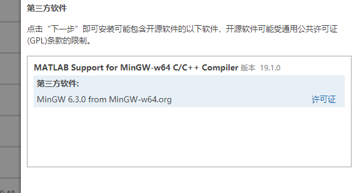
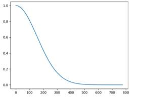
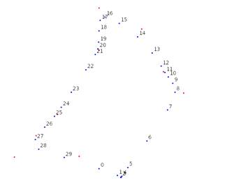
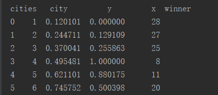

科研记录2019 -2020


# 量子优化算法

## 2019.5.24

https://blog.csdn.net/luqiang_shi/article/details/84672658#2QGApython_62

github项目中import需要修改，sklearn的cross_validation已经被抛弃，需要定位到代码位置修改。只需将 cross_validation 改为 model_selection 即可。

Github地址：

https://github.com/shiluqiang?tab=repositories

里面有几份PSO, GA, QPSO,QGA对SVM算法进行寻优的py代码。

已下载的代码存放在F:\PythonProgram

 

#  一些网站

Github：https://github.com/

Scipy官网：https://docs.scipy.org/doc/scipy/reference/optimize.html

很多科学计算的函数，如优化

编程语言网站：https://www.runoob.com/

清华软件网站：https://mirrors.tuna.tsinghua.edu.cn/

Google开发语言风格https://zh-google-styleguide.readthedocs.io/en/latest/

rpc框架：tars

https://github.com/TarsCloud/Tars

 

Matlab社区文档交换：

https://ww2.mathworks.cn/matlabcentral/fileexchange/48448-fast-linear-assignment-problem-using-auction-algorithm-mex

在这里可以查阅到一些算法的代码

Matlab官方函数说明：

https://ww2.mathworks.cn/help/matlab/ref/find.html

 

交大云盘：

https://jbox.sjtu.edu.cn/

http://mvls.sjtu.edu.cn/

 

# MAtTLAB 语法相关

## Matlab调用c++代码

需要安装mingw编译器，具体安装方法

下载官网mingw编译器，

https://www.mathworks.com/matlabcentral/fileexchange/52848-matlab-support-for-mingw-w64-c-c-compiler

需要登陆matlab账号：交大邮箱，密码常用密码，首字母大写。Matlab账户id：sherhang



安装好之后，先看一个简单的例子：

.cpp实现了一个加法函数，在matlab中调用它。

需要新建一个.cpp文件，#include”mex.h” 然后再添加一个mexFunction函数，这个函数用于连接cpp和matlab，在这个函数里面调用你的cpp, 然后传参就可以。执行mex 文件名   之后，创建了一个.mexw64的文件。这样以后就可以在该目录下调用你自己的cpp函数了。


my_add.cpp文件如下：

```c++
#include "mex.h"

    double
    my_add(double x, double y)

{

    return x + y;
}

/*

\*   nlhs 输出参数数目

\*   plhs 指向输出参数的指针

\*   nrhs 输入参数数目

*/

void mexFunction(int nlhs, mxArray *plhs[], int nrhs, const mxArray *prhs[])

{

    double *a;

    double b, c;

    plhs[0] = mxCreateDoubleMatrix(1, 1, mxREAL);

    a = mxGetPr(plhs[0]);

    b = *(mxGetPr(prhs[0]));

    c = *(mxGetPr(prhs[1]));

    *a = my_add(b, c);
}

```

 

 

## matlab在一个文件定义多个函数和主函数：

文件名和主函数相同，其他函数依次定义即可，可以直接运行。


## matlab修改默认编码格式

matlab默认的编码格式是GBK复制到文本里面中文乱码，feature('locale') 可以查看默认编码格式。

网上的修改方式不适用于matlabr2019

应该是：

打开E:\MATLABR2019a\bin目录下的lcdata_utf8.xml文件

添加


删除：


还是不行，待解决

另一种方法：中文部分复制到记事本，再复制粘贴就不会乱码了。

官方文档的方法：

**currentCharacterEncoding = slCharacterEncoding()** **返回当前 MATLAB** **字符集编码。**

**slCharacterEncoding(encoding)** **将 MATLAB** **字符集编码更改为指定的 encoding****。**您只能指定以下值：

'US-ASCII'

'Windows-1252'

'ISO-8859-1'

'Shift_JIS'

'UTF-8'

所以在文件前面加上：

slCharacterEncoding('UTF-8')

但是复制粘贴需要选只保留文本才行。没有多大意义。不改直接复制粘贴保留文本好像也行。

## matlab 画图

# 拍卖算法代码测试

Matlab开源社区源码：F:\上海交大\程序19.05.22\MATLAB\算法分类\拍卖算法\auction

最大化指派问题matlab测试数据：

 

```matlab
c =[0.7 0.1 0.1  0.7 0.4 0.7  0.6 0.7 0.8 0.5;

             0.9 0.9 0.8  0.9 0.8 0.9  0.6 0.4 0.3 0.3;

                 0.3 0.7 0    0.9 0.1 0.3  0.6 0.5 0.4 0.8;

           0.1 0.2 0.9  0.7 0.6 0.3   0.6 0.7 0.5 0.5;

           0.8 0.1 0.6  0.7 0.4 0.9   0.4 0.5 0.7 0.8;

           0.2 0.6 0.1  0.7 0.5 0.8   0.9 0.9 0.5 0.4;

           0.4 0.6 0.7  1 0.4 0.9     1 0.3 0.4 0.7;

           0.7 1 0.4    0 0.5 0.7    0.4 0.1 0.3 0.4;

           0.1 0.4 0.3   0.7 0.5 0   0.5 0.9 0.8 0.7;

          0.6 0.1 0.3   0.1 0.7 0.3   0.5 1 0.9 0;]

```

Python测试数据：

```python
c = [[0.7, 0.1, 0.1, 0.7, 0.4, 0.7, 0.6, 0.7, 0.8, 0.5],

        [0.9, 0.9, 0.8, 0.9, 0.8, 0.9, 0.6, 0.4, 0.3, 0.3],

         [0.3, 0.7, 0, 0.9, 0.1, 0.3, 0.6, 0.5, 0.4, 0.8],

        [0.1, 0.2, 0.9, 0.7, 0.6, 0.3, 0.6, 0.7, 0.5, 0.5],

        [ 0.8, 0.1, 0.6, 0.7, 0.4, 0.9, 0.4, 0.5, 0.7, 0.8],

        [0.2, 0.6, 0.1, 0.7, 0.5, 0.8, 0.9, 0.9, 0.5, 0.4],

        [0.4, 0.6, 0.7, 1, 0.4, 0.9, 1, 0.3, 0.4, 0.7],

        [ 0.7, 1, 0.4, 0, 0.5, 0.7, 0.4, 0.1, 0.3, 0.4],

        [0.1, 0.4, 0.3, 0.7, 0.5, 0, 0.5, 0.9, 0.8, 0.7],

        [0.6, 0.1, 0.3, 0.1, 0.7, 0.3, 0.5, 1, 0.9, 0]

     ]
```

```python
最大值是8.8，已知解[1 8 4 7 2 5 6 9 10 3]，

[1 8 4 7 2 5 6 10 9 3]，

[2 8 4 7 10 5 6 9 1 3]

匈牙利算法的结果是固定行号，列号是结果 [ 9  1 10  3  6  7  4  2  8  5]。表示行号【1 2 3 4。。。。】对应列号[9 1 10….]


```

 

```matlab
对开源社区代码测试：

AuctionJacobi.m 结果错误，未得到最大值

测试auction，在前面添加测试数据
w = [0.7 0.1 0.1  0.7 0.4 0.7  0.6 0.7 0.8 0.5;

           0.9 0.9 0.8  0.9 0.8 0.9  0.6 0.4 0.3 0.3;

			0.3 0.7 0    0.9 0.1 0.3  0.6 0.5 0.4 0.8;

           0.1 0.2 0.9  0.7 0.6 0.3   0.6 0.7 0.5 0.5;

           0.8 0.1 0.6  0.7 0.4 0.9   0.4 0.5 0.7 0.8;

           0.2 0.6 0.1  0.7 0.5 0.8   0.9 0.9 0.5 0.4;

           0.4 0.6 0.7  1 0.4 0.9     1 0.3 0.4 0.7;

           0.7 1 0.4    0 0.5 0.7    0.4 0.1 0.3 0.4;

           0.1 0.4 0.3   0.7 0.5 0   0.5 0.9 0.8 0.7;

           0.6 0.1 0.3   0.1 0.7 0.3   0.5 1 0.9 0;]

直接运行，结果8.8【2     8     4     7    10     5     6     9     1     3】

补充：nargin指调用函数的个数，缩写，直接运行则nargin=0

调用格式：[ won bet happy tt ] = auction( w, iter, e, verbose )

w=[4  3  4;1  4  4;4  8  4];4次可以出结果，e=0.1
```


## 6. SOM算法

GitHub源码：https://github.com/DiegoVicen/som-tsp

理解参见：https://mp.weixin.qq.com/s/O7UHeTFfcJ1FjNShVe9wtA

可解决TSP问题，距离衡量用欧几里得距离，且已经单位化，所以也是余弦相似度。

 

SOM算法基本知识：无监督学习，一般用于降维，数据可视化，聚类

https://blog.csdn.net/weixin_38347387/article/details/80342662

博客中例子理解：每一次循环，对于每个点，找到模获胜神经元w，然后让w靠近点，这个点就属于神经元w的类。这个例子学习因子是固定的。好的做法是设定一个衰减。同时，靠近程度应该是越近的影响越大才对。

进一步理解，SOM是一种降维。SOM网经过训练以后，在高维空间输入相近的样本，其输出相应的位置也相近。第二个例子。

SOM应用到TSP：

将神经元排成圆形，而非网络。同时让神经元的个数等于城市的个数，而此时城市其实也是聚类样本。只需要稍作修改，在邻域函数的作用下，自组织映射就会像一个弹性圆圈，不断靠近城市，同时尽量缩小总长度。

算法实现：

get_neighborhood(center, radix, domain):函数内部图像为



右端点为神经元个数//2。

 如何得到路径？取最后一次，按照获胜神经元的序号，依次取离它最近的城市坐标，排列好就是路径顺序。值得思考的是：为什么最后神经元一定按照初始创建的顺序序号排列好？初始位置是随机的。原因在于距离的定义：源代码中，距离是按照序号距离来定义的，那么序号靠近的相互之间作用大，序号越近越容易最后靠在一起。所以SOM用于TSP是一个几何算法。



总结一下这个算法：

Step1: 从city列表随机选一个，找出离他最近的神经元。

Step2: 计算获胜神经元周围的神00.经元移动的系数，获胜的是1， 序号离他越远这个值越小，接近0，就是上面的函数图像。可以这样理解：把神经元按照序号排成一个圆，那么对面的离它最远。

Step3: 神经元位置更新，用上面的系数 * 选中的city坐标-每个neuron坐标。

Step4: 迭代多次，得到city-获胜神经元列表，计算路径。



思考：

1． 收敛准则：如果获胜神经元坐标都覆盖了城市坐标，那么已经得到最优解了。可以改进。

2． 如果在地图里面加入不可行区域会怎么样？

## matplotlib 画图

https://www.runoob.com/numpy/numpy-matplotlib.html

https://www.runoob.com/w3cnote/matplotlib-tutorial.html

### 静态图 png

导入模块一般

import numpy as np

import matplotlib.pyplot as plt

如果用import pylab import * ,接近matlab，但是不推荐用。

三种画图方式：pyplot函数式,  pylab,  类封装

用类封装的方式更接近底层，推荐。

https://blog.csdn.net/wj1066/article/details/78896019

但是最常用的还是

import numpy as np

import matplotlib.pyplot as plt

 

推荐查看matplotlib画廊：https://matplotlib.org/gallery.html

 

目前就用这个吧。

函数图像等图

画图之前加上

lt.rcParams['font.sans-serif']=['SimHei']

plt.rcParams['axes.unicode_minus'] = False

可以正常显示中文和正负号

Title, label, ticklabel

 

 

**line1 = ax.plot(x, y, color=’red’, linestyle='-', linewidth=2 ,dashes=[30, 5, 10, 5],**

**label='****我的标签')**

\# ’-‘设置线形，可以多样，如’--'虚线，’-*’，甚至’-2’等，记住’—’ ‘-.’ ‘:’ ‘-‘

\# dashes=[a,b,c,d]表示虚线设置，画a个点，b个空，再画出c个，d个空，这样就能实现自定义虚线。

\# label 标签名，出现在线条旁边

 

**ax.scatter(x, y, c=color, s=scale,  marker=’’,  label=str(color),  # scale****对应每个点的大小**

​               **alpha=0.5, edgecolors='none')   # alpha** **是颜色深度，值越大颜色越深**

**marker****的值**


 

### plt 绘制动图以及gif

https://blog.csdn.net/qq_28888837/article/details/85778395

 

```python
import matplotlib.animation as animation

import matplotlib.pyplot as plt

ims = []

fig = plt.figure()

for i in range(1,10):

    im = plt.scatter(1,1).findobj()  # scatter要加findobj(),  plot不用

    ims.append(im)

ani = animation.ArtistAnimation(fig, ims, interval=200, repeat_delay=1000)

ani.save("test1.gif", writer='pillow')
```

 

# 分配算法代码测试

MATLAB 写文件进入txt

```matlab
% 记录日志

fid = fopen('log.txt','a');  % a追加写

t=datetime;

fprintf(fid,datestr(t));

fprintf(fid,'\n');

fclose(fid);
```

 

拍卖算法误差是n*e, 所以用1/n

测试代码主要包括：auction, munkres（KM）,q, base

 

# 聚类算法思考

任务分配的第一阶段如果是聚类怎么用？聚类目标与约束？现对匈牙利算法针对多机多目标进行仿真，Python代码测试，目标：每个飞机目标数量有上限，使得总距离和最小。

# LaTeX安装

https://blog.csdn.net/sleepingemperor/article/details/80394018


 

```latex
\documentclass[UTF8]{ctexart}

\begin{document}

$
k'(x)=\lim_{\Delta x\to 0}\frac{k(x)-k(x-\Delta x)}{\Delta x}

$

\end{document}
```


$$
k'(x)=\lim_{\Delta x\to 0}\frac{k(x)-k(x-\Delta x)}{\Delta x}
$$
Tex数学公式

https://blog.csdn.net/u013346007/article/details/54138690

 $\max \limits_{1<x<100}f(x)$

$
\max \ F=w_{1}\sum\limits ^{m}_{i=1}\sum\limits ^{n}_{j=1} f_{i,j}x_{i,j} 
+w_{2}\min \limits_{1\leqslant i\leqslant m,1\leqslant j\leqslant n}
 \frac{s_{i,j}}{v_{i,j}}\ \ 
$
$$
\max \ F=w_{1}\sum\limits ^{m}_{i=1}\sum\limits ^{n}_{j=1} f_{i,j}x_{i,j} 
    +w_{2}\max \limits_{1\leqslant i\leqslant m,1\leqslant j\leqslant n}
    \frac{s_{i,j}}{v_{i}}\ \\
    \mbox{s.t.}\quad \sum ^{m}_{\ i=1} x_{i,j} \leqslant 1\ or\ 2\\\label{}
    \sum ^{n}_{j=1} x_{i,j} \leqslant b_{j}
$$


# 数据集

## TSP数据集

https://my.oschina.net/ahaoboy/blog/1823450

测试一下py 的SOM算法

 

# MATLAB 语法

## 快捷键

```
Ctrl + A 全选， ctrl + i  自动排版
tab 自动补全
Ctrl + F1  函数帮助
```


## OOP编程

[类的定义](https://blog.csdn.net/weixin_41923961/article/details/80113632)


algoCross=["PMX","OX1","OX2","CX","PBX"];
algoMutate=["EM","DM","IM","SIM","IVM","SM","LM"];


| 算法      | 平均最优值        | 误差   |收敛步数 | 执行时间/s |
| --------- | ----------------- | ---- | -------- | ---------- |
| SAA_EM  |  0.53918  |  0.79500%  |  200  |  1.902  |
| SAA_DM  |  0.53578  |  1.42073%  |  200  |  1.833  |
| SAA_IM  |  0.53772  |  1.06398%  |  200  |  1.819  |
| SAA_SIM  |  0.53677  |  1.23923%  |  198  |  1.795  |
| SAA_IVM  |  0.53560  |  1.45438%  |  191  |  1.799  |
| SAA_SM  |  0.53542  |  1.48708%  |  200  |  1.838  |
| SAA_LM  |  0.53442  |  1.67107%  |  200  |  1.991  |
| GA_PMX_EM  |  0.54284  |  0.12319%  |  191  |  4.989  |
| GA_PMX_DM  |  0.54101  |  0.45950%  |  198  |  5.019  |
| GA_PMX_IM  |  0.54239  |  0.20459%  |  192  |  5.001  |
| GA_PMX_SIM  |  0.54196  |  0.28428%  |  201  |  5.000  |
| GA_PMX_IVM  |  0.54124  |  0.41703%  |  193  |  5.013  |
| GA_PMX_SM  |  0.54156  |  0.35692%  |  201  |  4.987  |
| GA_PMX_LM  |  0.54131  |  0.40455%  |  181  |  4.975  |
| GA_OX1_EM  |  0.54201  |  0.27419%  |  193  |  5.134  |
| GA_OX1_DM  |  0.53956  |  0.72530%  |  201  |  5.153  |
| GA_OX1_IM  |  0.54157  |  0.35524%  |  196  |  5.139  |
| GA_OX1_SIM  |  0.54138  |  0.39072%  |  197  |  5.143  |
| GA_OX1_IVM  |  0.54111  |  0.44028%  |  197  |  5.150  |
| GA_OX1_SM  |  0.54039  |  0.57258%  |  200  |  5.158  |
| GA_OX1_LM  |  0.54092  |  0.47511%  |  190  |  5.140  |
| GA_OX2_EM  |  0.54253  |  0.17994%  |  179  |  5.211  |
| GA_OX2_DM  |  0.54078  |  0.50126%  |  184  |  5.228  |
| GA_OX2_IM  |  0.54183  |  0.30843%  |  180  |  5.412  |
| GA_OX2_SIM  |  0.54224  |  0.23324%  |  191  |  5.391  |
| GA_OX2_IVM  |  0.54084  |  0.48948%  |  178  |  5.179  |
| GA_OX2_SM  |  0.54146  |  0.37590%  |  193  |  5.310  |
| GA_OX2_LM  |  0.53905  |  0.82027%  |  176  |  5.978  |
| GA_CX_EM  |  0.54319  |  0.05797%  |  199  |  5.667  |
| GA_CX_DM  |  0.53979  |  0.68276%  |  198  |  5.588  |
| GA_CX_IM  |  0.54223  |  0.23472%  |  201  |  5.487  |
| GA_CX_SIM  |  0.54131  |  0.40383%  |  199  |  5.481  |
| GA_CX_IVM  |  0.54144  |  0.38073%  |  200  |  5.551  |
| GA_CX_SM  |  0.54100  |  0.46155%  |  198  |  5.484  |
| GA_CX_LM  |  0.53780  |  1.05048%  |  176  |  5.486  |
| GA_PBX_EM  |  0.54244  |  0.19675%  |  162  |  5.738  |
| GA_PBX_DM  |  0.54065  |  0.52486%  |  192  |  5.710  |
| GA_PBX_IM  |  0.54086  |  0.48635%  |  197  |  5.787  |
| GA_PBX_SIM  |  0.54154  |  0.36177%  |  200  |  6.109  |
| GA_PBX_IVM  |  0.54097  |  0.46639%  |  195  |  6.302  |
| GA_PBX_SM  |  0.54154  |  0.36153%  |  195  |  6.167  |
| GA_PBX_LM  |  0.53821  |  0.97405%  |  180  |  6.094  |
| IGA_PMX_EM  |  0.54350  |  -0.00000%  |  136  |  5.853  |
| IGA_PMX_DM  |  0.54283  |  0.12405%  |  189  |  5.867  |
| IGA_PMX_IM  |  0.54291  |  0.10852%  |  200  |  5.859  |
| IGA_PMX_SIM  |  0.54296  |  0.09975%  |  190  |  5.884  |
| IGA_PMX_IVM  |  0.54256  |  0.17349%  |  190  |  5.870  |
| IGA_PMX_SM  |  0.54270  |  0.14844%  |  201  |  5.833  |
| IGA_PMX_LM  |  0.53756  |  1.09407%  |  118  |  5.844  |
| IGA_OX1_EM  |  0.54324  |  0.04912%  |  195  |  5.986  |
| IGA_OX1_DM  |  0.54147  |  0.37423%  |  198  |  5.392  |
| IGA_OX1_IM  |  0.54227  |  0.22716%  |  201  |  6.024  |
| IGA_OX1_SIM  |  0.54167  |  0.33832%  |  194  |  6.013  |
| IGA_OX1_IVM  |  0.54135  |  0.39580%  |  201  |  6.058  |
| IGA_OX1_SM  |  0.54136  |  0.39425%  |  188  |  5.981  |
| IGA_OX1_LM  |  0.54164  |  0.34223%  |  187  |  5.985  |
| IGA_OX2_EM  |  0.54350  |  -0.00000%  |  191  |  5.991  |
| IGA_OX2_DM  |  0.54200  |  0.27661%  |  172  |  6.015  |
| IGA_OX2_IM  |  0.54263  |  0.16079%  |  195  |  6.010  |
| IGA_OX2_SIM  |  0.54212  |  0.25513%  |  195  |  6.006  |
| IGA_OX2_IVM  |  0.54173  |  0.32729%  |  188  |  6.058  |
| IGA_OX2_SM  |  0.54170  |  0.33279%  |  193  |  6.108  |
| IGA_OX2_LM  |  0.53787  |  1.03675%  |  119  |  6.062  |
| IGA_CX_EM  |  0.54324  |  0.04904%  |  152  |  5.826  |
| IGA_CX_DM  |  0.54161  |  0.34782%  |  196  |  5.861  |
| IGA_CX_IM  |  0.54148  |  0.37335%  |  194  |  5.865  |
| IGA_CX_SIM  |  0.54284  |  0.12297%  |  187  |  5.913  |
| IGA_CX_IVM  |  0.54230  |  0.22194%  |  192  |  5.906  |
| IGA_CX_SM  |  0.53971  |  0.69865%  |  180  |  5.850  |
| IGA_CX_LM  |  0.53462  |  1.63493%  |  122  |  5.837  |
| IGA_PBX_EM  |  0.54337  |  0.02452%  |  139  |  6.119  |
| IGA_PBX_DM  |  0.54158  |  0.35402%  |  200  |  6.172  |
| IGA_PBX_IM  |  0.54190  |  0.29457%  |  130  |  6.248  |
| IGA_PBX_SIM  |  0.54251  |  0.18382%  |  178  |  5.403  |
| IGA_PBX_IVM  |  0.54206  |  0.26518%  |  194  |  5.459  |
| IGA_PBX_SM  |  0.54090  |  0.47872%  |  200  |  5.356  |
| IGA_PBX_LM  |  0.53790  |  1.03107%  |  114  |  5.337  |
| SAGA_PMX_EM  |  0.54337  |  0.02482%  |  191  |  5.167  |
| SAGA_PMX_DM  |  0.54127  |  0.41086%  |  189  |  5.151  |
| SAGA_PMX_IM  |  0.54191  |  0.29426%  |  171  |  5.140  |
| SAGA_PMX_SIM  |  0.54176  |  0.32149%  |  179  |  5.163  |
| SAGA_PMX_IVM  |  0.54204  |  0.26894%  |  193  |  5.392  |
| SAGA_PMX_SM  |  0.54118  |  0.42706%  |  161  |  5.129  |
| SAGA_PMX_LM  |  0.53884  |  0.85785%  |  152  |  5.333  |
| SAGA_OX1_EM  |  0.54337  |  0.02441%  |  188  |  5.398  |
| SAGA_OX1_DM  |  0.54217  |  0.24643%  |  195  |  5.126  |
| SAGA_OX1_IM  |  0.54264  |  0.15990%  |  156  |  5.187  |
| SAGA_OX1_SIM  |  0.54270  |  0.14860%  |  198  |  5.450  |
| SAGA_OX1_IVM  |  0.54283  |  0.12386%  |  192  |  5.026  |
| SAGA_OX1_SM  |  0.54176  |  0.32127%  |  185  |  5.117  |
| SAGA_OX1_LM  |  0.53947  |  0.74294%  |  132  |  5.350  |
| SAGA_OX2_EM  |  0.54324  |  0.04904%  |  183  |  5.301  |
| SAGA_OX2_DM  |  0.54154  |  0.36180%  |  193  |  5.467  |
| SAGA_OX2_IM  |  0.54193  |  0.28932%  |  196  |  5.475  |
| SAGA_OX2_SIM  |  0.54171  |  0.33072%  |  182  |  5.400  |
| SAGA_OX2_IVM  |  0.54168  |  0.33610%  |  193  |  5.473  |
| SAGA_OX2_SM  |  0.54124  |  0.41609%  |  175  |  5.247  |
| SAGA_OX2_LM  |  0.53920  |  0.79185%  |  160  |  5.246  |
| SAGA_CX_EM  |  0.54337  |  0.02441%  |  174  |  5.268  |
| SAGA_CX_DM  |  0.54146  |  0.37571%  |  194  |  5.321  |
| SAGA_CX_IM  |  0.54151  |  0.36762%  |  165  |  5.536  |
| SAGA_CX_SIM  |  0.54214  |  0.25131%  |  157  |  5.384  |
| SAGA_CX_IVM  |  0.54178  |  0.31733%  |  199  |  5.160  |
| SAGA_CX_SM  |  0.54155  |  0.35993%  |  169  |  5.260  |
| SAGA_CX_LM  |  0.53935  |  0.76491%  |  152  |  5.080  |
| SAGA_PBX_EM  |  0.54350  |  0.00060%  |  196  |  5.122  |
| SAGA_PBX_DM  |  0.54058  |  0.53829%  |  195  |  5.312  |
| SAGA_PBX_IM  |  0.54148  |  0.37328%  |  157  |  5.102  |
| SAGA_PBX_SIM  |  0.54227  |  0.22698%  |  181  |  5.187  |
| SAGA_PBX_IVM  |  0.54212  |  0.25496%  |  188  |  5.530  |
| SAGA_PBX_SM  |  0.54088  |  0.48209%  |  172  |  5.197  |
| SAGA_PBX_LM  |  0.53875  |  0.87472%  |  194  |  5.071  |
| ACOSAGA | 0.54349 | 0.00298% | 46 | 5.807 |


   

